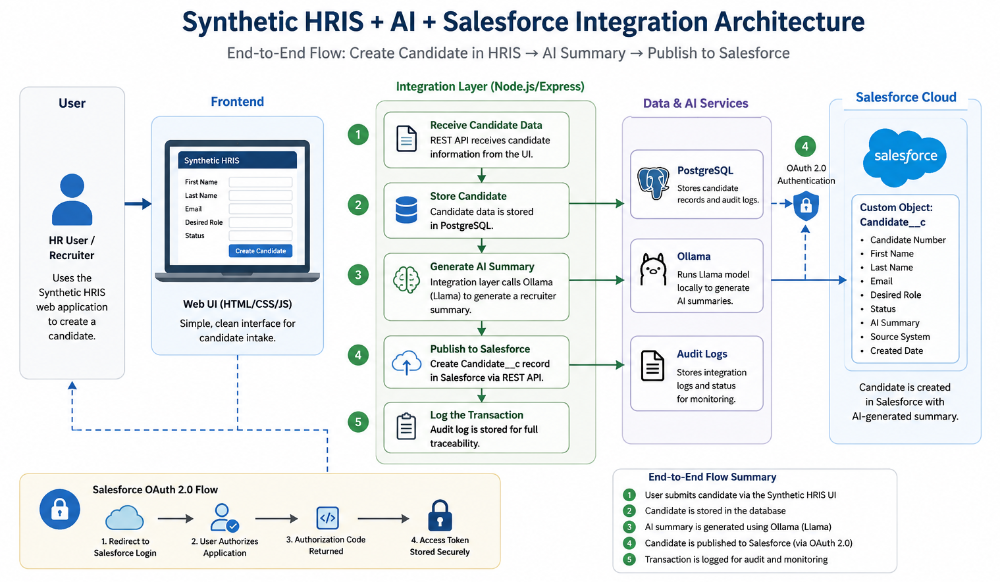

cat > README.md <<'EOF'
# Salesforce HR AI Integration Architecture

This repository documents a modern HR integration architecture that connects a synthetic HRIS workflow with Salesforce and AI-generated recruiter summaries.

## Overview

The project demonstrates an end-to-end enterprise integration pattern:

1. A user creates a candidate in a synthetic HRIS interface.
2. The integration layer stores the candidate in a database.
3. An AI service generates a recruiter-facing summary.
4. The enriched candidate record is published to Salesforce.
5. Salesforce stores the result in a custom `Candidate__c` object.

## Architecture

## Key Capabilities

- Synthetic HRIS candidate intake
- Salesforce OAuth 2.0 authentication
- Salesforce REST API integration
- Custom Salesforce `Candidate__c` object
- AI-generated recruiter summary
- Database-backed candidate storage
- Audit logging for traceability

## Technology Stack

- Salesforce Developer Edition
- Salesforce REST API
- OAuth 2.0
- Node.js / Express
- PostgreSQL
- Ollama / local LLM
- Docker
- HTML / CSS / JavaScript

## Demo Flow

The demo shows a user creating a candidate in a synthetic HRIS UI. The integration layer stores the candidate, generates an AI summary, and publishes the enriched record into Salesforce.

## Repository Scope

This is a public architecture portfolio repository. It intentionally excludes implementation code, secrets, credentials, and environment-specific configuration.

EOF